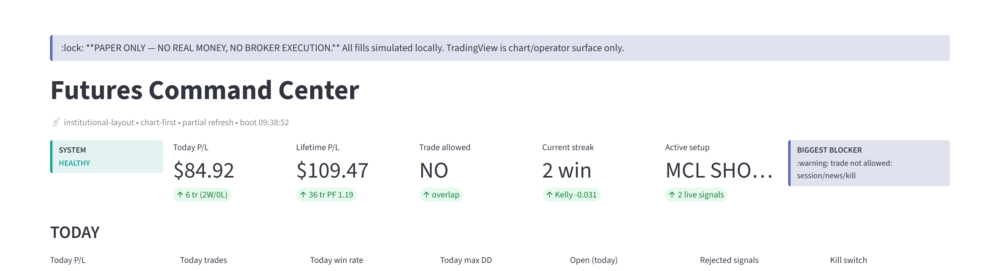
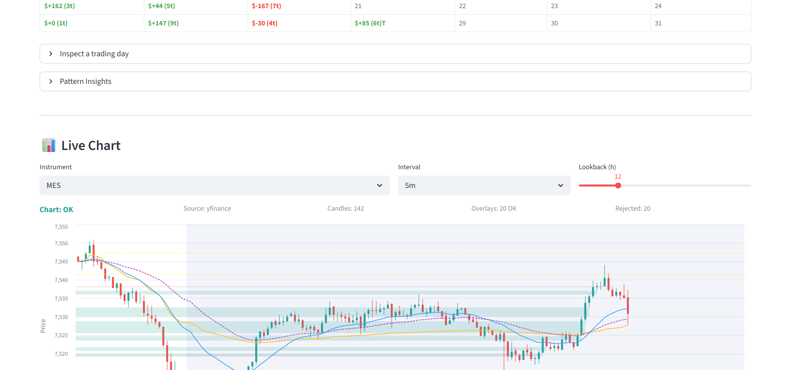
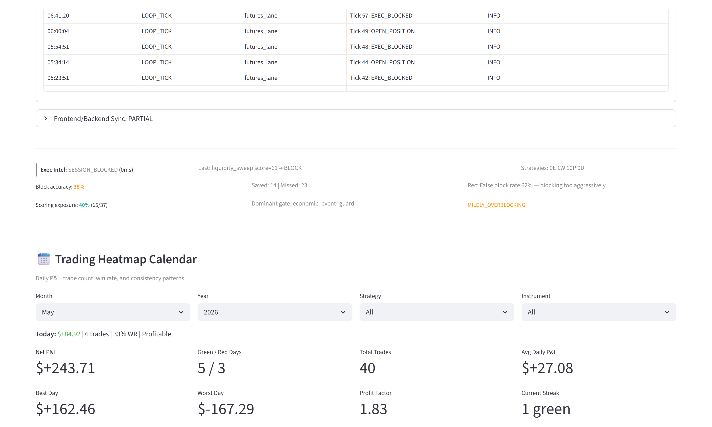

# Futures Adaptive Desk

   

> An autonomous, **paper-only** futures research desk. Rule-based strategies generate signals, a confluence engine scores them 0–100, and a learning loop measures whether those scores actually predicted outcomes — then conservatively self-tunes. Built for **data collection and model validation, not "automated profit."**

> ⚠️ Paper / simulated fills only. No broker execution. Not financial advice. This repo is a **cleaned, representative subset** of a larger private system.



## Why this exists

Most retail "trading bots" assume their signal is good and optimize sizing. This does the opposite: execution is paper-only, and the headline feature is a measurement layer that tells me **honestly** whether the edge is real yet. Right now it reports the scoring is *not yet predictive* — which is the point.

## How it works

```
bars → HTF bias → session → signal_engine (rules) → confluence_engine (0–100)
     → risk_engine (gate stack) → paper fill OR shadow-log → journal
     → score_validator (did score predict R?) → governor (conservative tune)
```

See [`docs/architecture.md`](docs/architecture.md) · [`docs/learning_loop.md`](docs/learning_loop.md) · [`docs/safety_model.md`](docs/safety_model.md).

## Repository layout

```
src/            signal_engine · confluence_engine · risk_engine · score_validator · futures_lane
docs/           architecture · learning_loop · safety_model
configs/        desk_config.example.yaml
demo_data/      sanitized sample journal / score-validation / tick log
observability/  daily_self_audit example
examples/       run_one_tick.py
assets/         dashboard screenshots + architecture diagram
```

## Quickstart

```bash
pip install -r requirements.txt
python examples/run_one_tick.py     # paper tick; no live bars → NO_CANDIDATE is expected
```

To see the learning loop on sample data:

```python
import json, sys; sys.path.insert(0, "src")
from score_validator import validate
print(validate(json.load(open("demo_data/sample_journal.json"))["closed"]))
```

## Screenshots

| | |
| --- | --- |
|  |  |
| Live chart: candles + EMA/VWAP/structure overlays | The desk critiquing its own decisions (over-blocking detection) |

## Honest status

- **Paper only**, data-collection phase. ~36 simulated trades logged (mixed W/L).
- Scoring verdict: **PARTIALLY_PREDICTIVE** at small sample — reported truthfully, not hidden.
- No live profitability is claimed or implied.

## Tech

Python · pandas · numpy · yfinance · SQLite · Streamlit · $0 paid APIs.

## License

MIT — see [LICENSE](LICENSE).
