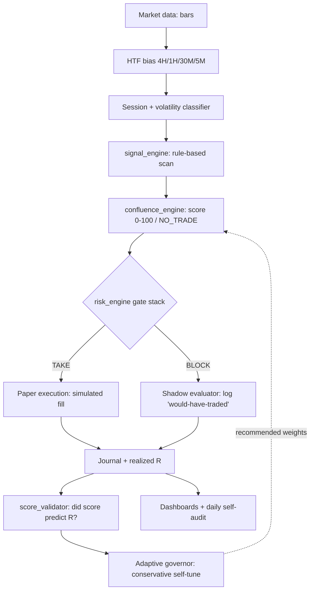
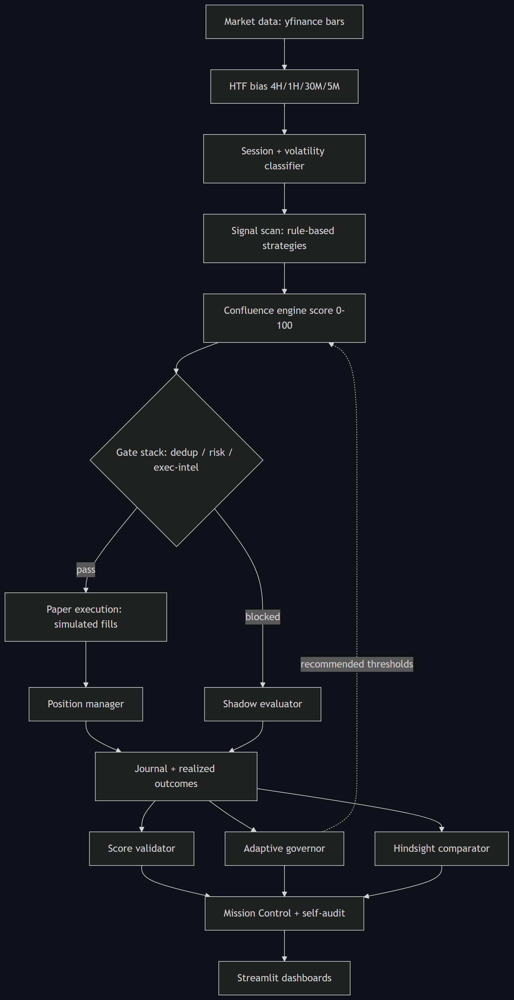

# Architecture — Futures Adaptive Desk

> Representative/cleaned subset of a larger private system. Paper-only.

## Tick lifecycle (~5 min)

## Modules in this showcase

| File | Responsibility |
| --- | --- |
| `src/signal_engine.py` | Rule-based, explainable setup detection (3 sample strategies) |
| `src/confluence_engine.py` | Transparent 0-100 weighted score; `NO_TRADE` below threshold |
| `src/risk_engine.py` | Gate stack: kill-switch, news window, trade cap, drawdown, cooldown |
| `src/score_validator.py` | Score -> outcome correlation + honest predictiveness verdict |
| `src/futures_lane.py` | One-tick orchestrator wiring the above together |

## What is intentionally *not* here

The full runtime adds higher-timeframe bias computation, a live data provider,
position management (break-even/trail), SQLite bar persistence, a shadow
evaluator, the self-tuning governor, and Streamlit dashboards. Those are
summarized in the diagram and screenshots but kept out of this public subset.

## Design principles

- **Explainable over clever** — every signal has a reason; the score is a plain weighted sum.
- **Measure before trusting** — see [`learning_loop.md`](learning_loop.md).
- **Safe by default** — see [`safety_model.md`](safety_model.md).
